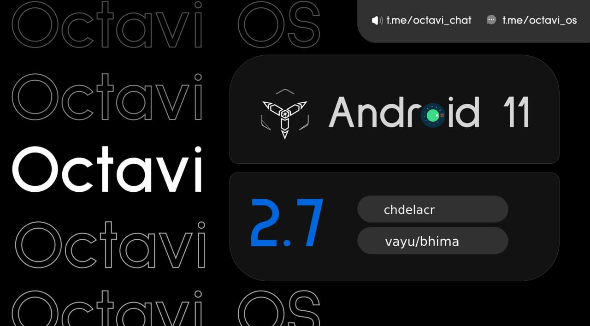

# Changelog for Poco X3 Pro (vayu/bhima)

Join [@cdlc_builds](https://t.me/cdlc_builds) and follow me as [@cdlc_blog](https://t.me/cdlc_blog) in Telegram

Please refer to the [flashing guide](https://github.com/chdelacr/ROMs_Changelogs/blob/main/flashing_guide_vayu.md) for Poco X3 Pro (vayu/bhima)

## Octavi OS 2.7 - 15/07/2021
- Switched to Etherious kernel v2.1 (better battery backup)
- Made Always On Display available
- Enabled multi user UI
- Moved Thermal Profiles to System
- Added FPS tile