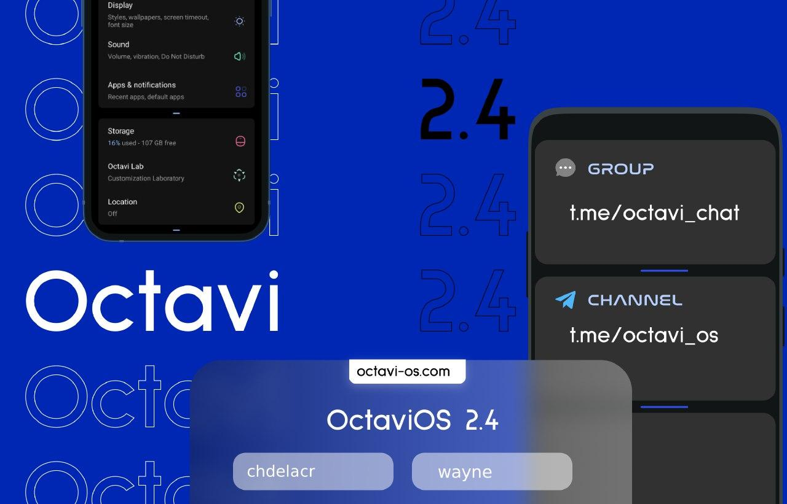
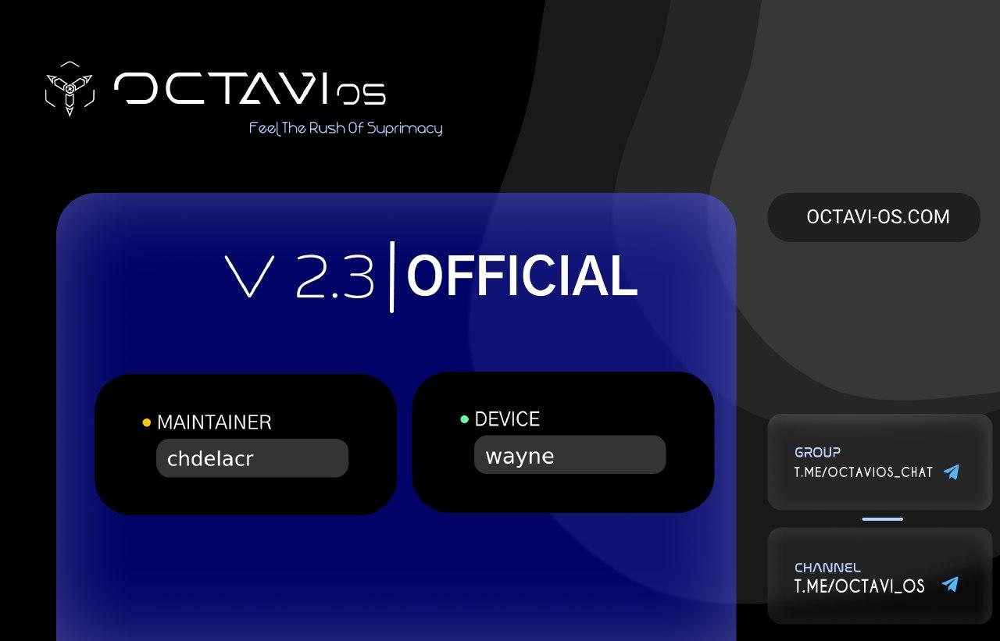

# Octavi OS 2.4 - 10/05/2021
- Switched to Westcoast Kernel v4.4.268 (due to phone freezing issues)
- Fix lags on live wallpapers
- Update charger blobs
- Add missing audio routes
- Switch back to audio v6
- Refined early phase offsets
- Build iorap targets
- Support new ANT stack
- Cleanup light hal

## Notes:
- Clean flash if you experience any bug
___

# Octavi OS 2.3 - 25/04/2021
- Switched to Illium Kernel v4.4.267
- Rebased tree:
    - More DeviceSettings
    - Working night light and WFD

## Notes:
- Clean flash recommended

## Credits:
- Thanks to [@clarencelol](https://t.me/clarencelol) for tree and support
- Thanks to [@ranjumh](https://t.me/ranjumh) for testing